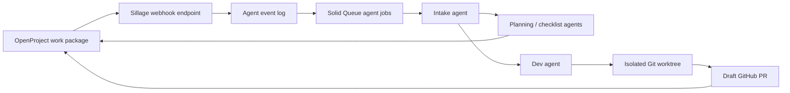

# Exopter OpenProject Agent Workflow

Status: design only. Nothing described here is implemented yet.

This document describes a proposed workflow for connecting the self-hosted
OpenProject instance at `projects.wild.eu` with agent-assisted planning,
software development, design work, and checklist generation for the Exopter
project.

The goal is to let agents help when a new OpenProject work package is created,
while keeping human control over scope, safety-sensitive decisions, merge,
deployment, and production operations.

## Current Design Decisions

- The workflow is hosted inside the existing Sillage Rails application.
- OpenProject sends work-package webhooks to Sillage.
- A task is ignored by default unless it is explicitly marked agent-eligible.
- Agent execution uses a dedicated Codex runner, not the web process.
- The default autonomy level is `Plan + draft PR`.
- Agents may analyze, plan, create checklists, edit code in isolated worktrees,
  run tests, and open draft pull requests.
- Agents must not merge, deploy, restart services, modify production data,
  change permissions, or mark safety-sensitive work complete without explicit
  human approval.

## OpenProject Configuration

Create a dedicated service account such as `sillage-agent` with the smallest
useful permission set on the Exopter project.

Recommended custom fields:

| Field | Purpose |
| --- | --- |
| `Agent Mode` | Explicit opt-in. Suggested values: `Off`, `Plan`, `Checklist`, `Dev`, `QA`, `Full triage`. |
| `Agent Autonomy` | Controls how far agents may go. Default: `Plan + draft PR`. |
| `Agent Status` | Tracks orchestration state such as `Queued`, `Running`, `Blocked`, `Draft PR`, `Needs review`, `Done`. |
| `Agent Run ID` | Stores the current Sillage-side run identifier. |
| `Roadmap Lane` | Routes work to the right project context. Suggested values: `GLD`, `EPW`, `JPW`, `HUD/FDR`, `Flight Lab`, `Operations/Certification`, `Training/Procurement`. |
| `Safety Criticality` | Flags work that needs stricter human review. Suggested values: `Non-safety`, `Safety-adjacent`, `Flight-critical`. |

Recommended webhook events:

- Work package created.
- Work package updated.
- Work package comment created.

The webhook should be scoped to the Exopter project only. Sillage must verify
the webhook signature before storing or acting on any event.

## High-Level Architecture



Sillage is the orchestrator and audit surface. The Codex runner performs the
actual agent work in isolated execution contexts. OpenProject remains the
planning source of truth, and GitHub remains the code review surface.

## Work Package Lifecycle

1. A human creates or updates an OpenProject work package.
2. OpenProject sends a signed webhook to Sillage.
3. Sillage stores the raw event and deduplicates it.
4. Sillage checks whether `Agent Mode` is enabled.
5. The intake agent snapshots the work package and classifies it by lane,
   work type, and safety criticality.
6. If required context is missing, the agent posts a concise blocking comment
   in OpenProject and stops.
7. If the task is ready, Sillage starts the requested agent lane.
8. Agents post plans, checklists, child-task proposals, or draft PR links back
   to OpenProject.
9. A human reviews the result and decides whether to continue, merge, deploy,
   or close the task.

Agent comments should include a hidden marker such as:

```html
<!-- sillage-agent run=<uuid> -->
```

This marker lets Sillage ignore its own comments and avoid webhook loops.

## Agent Lanes

### Intake Agent

The intake agent runs first for every eligible work package.

Responsibilities:

- Verify that the task is explicitly agent-enabled.
- Read the work package title, description, type, status, priority, custom
  fields, attachments, comments, and linked work packages.
- Classify the task into a roadmap lane.
- Detect missing context.
- Decide whether to route to planning, checklist, development, QA, or a mixed
  sequence.
- Post a short execution plan or blocking question.

### Planning And Design Agent

Use this lane for vague, early, or cross-functional tasks.

Responsibilities:

- Turn a broad request into acceptance criteria.
- Identify assumptions, risks, dependencies, and review gates.
- Propose child work packages when the work is too large.
- Connect the task to the relevant Exopter lane: GLD, EPW, JPW, HUD/FDR,
  Flight Lab, Operations/Certification, or Training/Procurement.

### Checklist Agent

Use this lane for operational, test, review, and safety-adjacent work.

Responsibilities:

- Produce actionable checklists for design review, bench tests, HIL tests,
  import/replay validation, HUD/FDR verification, and flight-readiness review.
- Separate software checks from physical, operational, and human-review checks.
- Mark any flight-critical checklist as human-owned.

### Dev Agent

Use this lane for scoped software work in the Sillage repository.

Responsibilities:

- Create an isolated Git worktree.
- Create a branch named `codex/op-<work-package-id>-<slug>`.
- Follow the repository instructions and keep all project-facing text in
  English.
- Implement only the scoped change.
- Run relevant tests.
- Open a draft pull request against the main repository.
- Post the branch, draft PR, test result, and remaining risks back to
  OpenProject.

### QA Agent

Use this lane after a draft PR, prototype, or checklist exists.

Responsibilities:

- Review acceptance criteria against the implemented change.
- Check for missing tests, risky assumptions, and unclear operational steps.
- Summarize what is ready for human review and what still needs work.

## Safety And Governance

The default rule is that agents assist but humans remain accountable.

Hard restrictions:

- No merge without human approval.
- No deployment without human approval.
- No production data write without human approval.
- No destructive action without human approval.
- No permission or credential change without human approval.
- No final completion of `Safety-adjacent` or `Flight-critical` tasks without
  human approval.

Safety-sensitive examples:

- HUD alerts.
- FDR integrity.
- Propulsion behavior.
- Parachute and jettison systems.
- Flight test operations.
- Live telemetry and pilot guidance.
- Any behavior that could affect pilot decisions in flight.

For these tasks, agents may draft analysis, tests, checklists, simulations, and
review notes, but the final decision stays human-owned.

## Sillage Data Model Proposal

This is a design note, not an implementation requirement yet.

Recommended records:

- `OpenProjectEvent`: raw signed webhook event, deduplication key, event type,
  work-package id, and processing state.
- `AgentRun`: one orchestration attempt for one work package.
- `AgentArtifact`: generated plan, checklist, branch, PR link, test output
  summary, or uploaded file reference.
- `AgentComment`: OpenProject comments posted by Sillage, with hidden marker
  and run id.

Recommended environment variables:

- `OPENPROJECT_BASE_URL`
- `OPENPROJECT_API_TOKEN`
- `OPENPROJECT_WEBHOOK_SECRET`
- `GITHUB_REPOSITORY`
- `GITHUB_TOKEN`
- `AGENT_RUNNER_ENABLED`
- `AGENT_RUNNER_WORKDIR`

Secrets must stay local or in the deployment secret store. They must not be
committed.

## Roadmap Alignment

The workflow should route Exopter work into the following lanes:

- `GLD`: glider wing design, systems, prototypes, tunnel tests, and flight
  tests.
- `EPW`: electric-powered wing design, electrical chain, EDF/Bicopter modes,
  EPW prototypes, and powered tests.
- `JPW`: jet-powered extension, P1000 architecture, jetwing production, and JPW
  tests.
- `HUD/FDR`: display modes, sensors, recording, upload, replay, alerts, and
  data integrity.
- `Flight Lab`: Rails application, FlySight imports, visualization, replay,
  logbook, maintenance, and analysis.
- `Operations/Certification`: risk assessment, airworthiness, compliance,
  training readiness, and demonstration planning.
- `Training/Procurement`: pilot equipment, license training, spare parts, and
  supplier follow-up.

Suggested milestone labels:

- `T0+3`
- `T0+6`
- `T0+9`
- `T0+12`
- `T0+18`
- `T0+24`
- `JPW Extension`

## Rollout Plan

### Phase 0: Documentation

- Keep this document as the initial design reference.
- Do not configure webhooks or run agents yet.
- Confirm the OpenProject custom fields and service-account permissions.

### Phase 1: Read-Only Intake

- Add webhook receipt and event logging.
- Validate signatures and deduplication.
- Classify eligible tasks but do not post comments or start runners.

### Phase 2: Planning Comments

- Allow agents to post plans, missing-context questions, and checklists.
- Keep code execution disabled.
- Validate that comment markers prevent webhook loops.

### Phase 3: Draft PR Automation

- Enable the Codex runner for software tasks only.
- Run in isolated worktrees.
- Open draft PRs and post links back to OpenProject.
- Keep merge and deployment human-owned.

### Phase 4: Operational Hardening

- Add dashboards for run state and failures.
- Add monitoring for webhook failures and stale agent runs.
- Document recovery procedures.
- Review permissions, logs, and retention.

## Not Implemented Yet

The following items are intentionally not implemented by this document:

- Rails routes.
- Controllers.
- Models.
- Migrations.
- Solid Queue jobs.
- OpenProject service account.
- OpenProject webhook configuration.
- OpenProject custom fields.
- Codex runner.
- GitHub draft PR automation.
- Deployment changes.
- Production credentials.

This document is only the design record for a future implementation.
