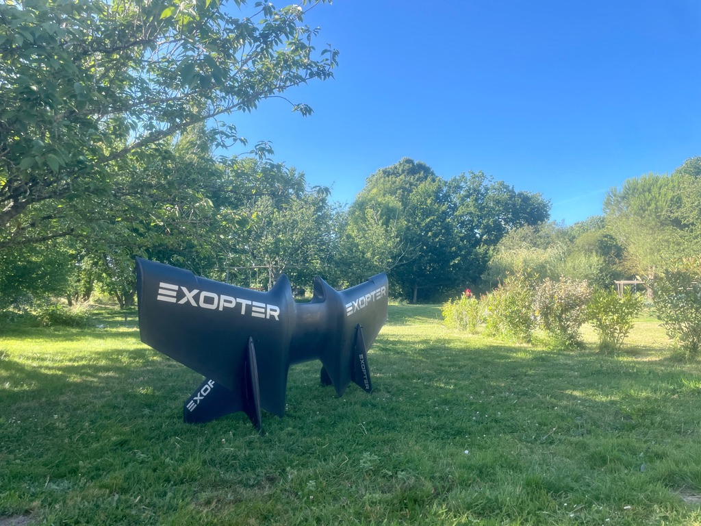

# Exopter Design System

Exopter is a personal rigid-wing flight program, not a generic aviation app,
drone brand, or futuristic decoration set. The design system should feel like a
piece of flight-test equipment: matte, precise, physical, safety-aware, and
quietly ambitious.

This document is the first Exopter design-system foundation. It is grounded in
the available wing photo and the project documents in `docs/`.

## Source Inputs

- `docs/Draft specs to Contractor on EPW prototype v4 2026 02 03.docx`:
  GLD and EPW program scope, phase structure, performance targets, prototypes,
  testing, operator training, and required documentation.
- `docs/EXO - DEV - HUD & FDR requirements - V0.1 - 26JAN2026 - BLD.xlsx`:
  HUD/FDR requirements, display behavior, sensors, flight data, alerts,
  communications, hardware placement, and pilot-assistance functions.
- `docs/ORG - ACC - CUS - QTN - Short Draft Singapore pricing GLD   EDF - V0.5 - 09FEB2026 - BLD.xlsx`:
  commercial summary for GLD, EPW, training, test campaigns, and demonstration
  milestones.
- `docs/ORG - ACC - CUS - QTN - Draft Singapore pricing GLD   EDF - V4 - 09FEB2026 - BLD.xlsx`:
  detailed costing around aero design, systems, jettison, parachute, FDR,
  communication, equipment, tests, and EPW electrical chain.
- `docs/ORG - ACC - CUS - QTN - Draft Singapore pricing OPTIONS GLD   EDF - V0.1 - 09FEB2026 - BLD.xlsx`:
  optional surfaces such as extra pilot training, certification, series
  production, payload container, landing assistance, spare parts, and flight
  data live helmet display.
- `docs/ORG_MNG_roadmap short_V0.1_20260526_CTS.xlsx`:
  practical roadmap from GLD to EPW/EDF, Bicopter, and JPW/P1000 work.
- `docs/openproject-agent-workflow/README.md`:
  Sillage orchestration, roadmap lanes, safety criticality, and agent-assisted
  work governance.
- `docs/Updated COC_20 Jan 2026 - cleaned commentaires MPO.docx`:
  contract-grade expectations around confidentiality, safety, integration,
  interoperability, documentation, acceptance, IP, and governance.

## Product Architecture

Use these names deliberately.

| Name | Role | Design implication |
| --- | --- | --- |
| Exopter | Master brand, company, vehicle program, and public-facing identity. | Physical, iconic, confident, minimal. |
| Exowing | Wing-system name used in several source documents. | Use for aircraft/system references, especially GLD, EPW, JPW, prototypes, and contract material. |
| Sillage | Exopter operating software suite. | Avionics workbench for preparation, replay, analysis, maintenance, agents, and operations. |
| GLD | Glider Wing System, unpowered rigid-wing validation stage. | Baseline flight-test mode: aerodynamic, lightweight, sensor-led. |
| EPW / EDF | Electric-Powered Wings System and electric ducted fan mode. | Adds power, autonomy, batteries, temperature, engine control, and ground station concerns. |
| JPW / JET | Jet-powered extension in the roadmap and HUD mode. | Future high-energy mode; use carefully until requirements mature. |

The system should scale from a single matte-black wing to a family of software,
hardware, training, certification, and operational surfaces without feeling like
separate brands.

## Program Truths That Shape Design

The visual system must respect the actual flight program.

- The first validated stage is GLD: an unpowered rigid-wing system used to
  prove aerodynamics, structure, safety, human factors, parachute integration,
  sensors, communication, and FDR workflows.
- EPW adds electric propulsion, battery, BMS, ESC, power, temperature, autonomy,
  and ground-station concerns to the GLD architecture.
- JPW is a later jet-powered roadmap extension and should not visually dominate
  the brand before the GLD/EPW language is mature.
- Core performance references include one pilot, a target pilot range of 80 to
  95 kg, an optimal speed range of 170 to 230 km/h, a deployed wingspan up to
  2.5 m, parachute opening around 1500 m, GLD horizontal distance beyond 10 km,
  and EPW horizontal distance beyond 25 km from an exit altitude up to 5000 m.
- Test reality matters: analysis, CFD, structural work, molds, tunnel tests,
  parachute tests, flight tests, training, official demonstration, acceptance,
  certification, and series-production options all need UI and document support.
- Hardware placement is part of the design language: wing for pitot/pressure,
  GPS, and camera; seat for attitude, GPS, and VHF; helmet for GPS, intercom,
  camera, and HUD.
- Safety systems are central, not secondary: jettison, rescue parachute,
  attachment, harness, audible altimeter, emergency deactivation, watchdog,
  startup tests, and fault warnings should have explicit visual treatments.

## Design Position

Exopter should feel:

- **Precise**: every label, number, state, and control has a reason.
- **Physical**: the wing is real carbon, harnesses, hooks, sensors, parachutes,
  batteries, and test equipment, not abstract SaaS inventory.
- **Calm under pressure**: safety information is unmistakable but never
  theatrical.
- **Fast but restrained**: motion and angles can imply speed; color should not
  scream.
- **Contract-grade**: documents, checklists, specs, logs, and acceptance
  surfaces must look ready for suppliers, pilots, and authorities.

Avoid:

- stock aviation glamour, luxury-lifestyle language, comic-book flight, toy
  drone aesthetics, fantasy cockpit UI, decorative neon overload, and generic
  dark-blue SaaS dashboards;
- rounded pill-heavy controls when a compact icon, switch, segmented control,
  or instrument-style control is clearer;
- vague atmospheric images when the actual wing, pilot equipment, maps, data,
  or test setup can be shown.

## Brand Marks

The current physical reference is the white `EXOPTER` wordmark on the matte
black wing.

Observed traits:

- uppercase geometric wordmark;
- forward technical stance;
- three horizontal speed bars before the `E`;
- white mark on matte carbon black;
- simple secondary `EXO` marking on fins and smaller surfaces.

Rules until source artwork exists:

- Do not redraw the official wordmark for final production from the photo.
- For internal mockups, approximate the wordmark only as a placeholder and mark
  it as non-final.
- Preserve strong contrast: white or vapor mark on carbon, or carbon mark on a
  light technical background.
- Keep generous clearspace around the wordmark. Use the height of the `E` bars
  as the minimum clearspace on all sides.
- Do not place the wordmark over busy scenery unless a dark overlay or clean
  wing surface keeps it fully legible.

Future brand assets to produce:

- vector Exopter wordmark;
- compact `EXO` mark;
- monochrome lockups;
- favicon/app icon;
- wing silhouette or aerofoil mark for diagrams, not as the primary logo.

## Color System

The palette comes from the photo and the embedded requirements: matte carbon,
white wordmark, open sky, grass-field test environment, and HUD signal colors.

| Token | Hex | Role |
| --- | --- | --- |
| `--ex-carbon-950` | `#070B0D` | Primary brand black, cockpit backgrounds, fail-safe black. |
| `--ex-carbon-900` | `#10181A` | App chrome, instrument panels, dark cards. |
| `--ex-carbon-800` | `#182426` | Raised dark surfaces and hover states. |
| `--ex-graphite-600` | `#5F6C6B` | Secondary text, inactive states, technical rules. |
| `--ex-vapor-50` | `#F5F8F6` | Primary light background and white-mark equivalent. |
| `--ex-vapor-100` | `#E5ECE9` | Light panels, dividers, disabled fills. |
| `--ex-sky-500` | `#2EA8FF` | Navigation, route, open-sky references, links. |
| `--ex-field-500` | `#4F7B4E` | Ground, nature, readiness, environmental context. |
| `--ex-aqua-500` | `#2FD6C6` | Live telemetry, selected controls, active traces. |
| `--ex-hud-green` | `#8CFF4D` | HUD primary data, ready/safe flight signal. |
| `--ex-amber-500` | `#F2A23A` | Caution, pending checks, attention states. |
| `--ex-red-600` | `#E63B35` | Fault, danger, abort, destructive actions. |
| `--ex-white` | `#FFFFFF` | Wordmark, critical contrast on carbon. |

Usage rules:

- Carbon and vapor are the base. Signal colors annotate information; they do
  not become large decorative backgrounds.
- HUD green is reserved. Use it for pilot display concepts, ready states, and
  safety-positive flight data, not for generic buttons.
- Amber means caution or incomplete verification. Red means fault, abort, or
  unsafe.
- Sky/aqua are for paths, telemetry, links, maps, and interaction focus.
- Field green is quieter than HUD green and can represent ground, readiness,
  training, or environmental context.
- Never rely on color alone. Pair signal color with label, icon, pattern, or
  position.

### Current Sillage Token Bridge

The Rails app currently uses `--ds-*` tokens in
`web/app/assets/stylesheets/application.css`. Keep those tokens for the current
implementation, but map them toward Exopter roles as the UI matures.

| Current token | Exopter role |
| --- | --- |
| `--ds-bg`, `--ds-panel`, `--ds-panel-2` | `--ex-vapor-*` light workbench surfaces. |
| `--ds-night`, `--ds-night-2` | `--ex-carbon-*` instrument and replay surfaces. |
| `--ds-teal`, `--ds-aqua` | `--ex-aqua-500` and selected telemetry states. |
| `--ds-amber`, `--ds-red` | Caution and fault states. |
| `--ds-lime` | `--ex-hud-green`, but only when the context is flight/HUD/ready. |
| `--ds-violet` | Specialist analysis accent only; avoid making it a brand color. |

## Typography

Typography should be technical, readable, and aviation-adjacent without becoming
fake cockpit lettering everywhere.

| Layer | Direction | Usage |
| --- | --- | --- |
| Brand wordmark | Custom geometric uppercase. | Exopter logo only. |
| Product UI | Inter, Aptos, or equivalent modern sans. | Sillage app, docs, dashboards, forms. |
| Instrument data | Tabular sans or mono. | Airspeed, altitude, glide, distance, telemetry. |
| Code/agent/log text | Geist Mono, IBM Plex Mono, or system mono. | Logs, event IDs, sensor rows, checks. |

Rules:

- Use tabular numerals for metrics, telemetry, durations, dates, and prices.
- Keep interface headings compact. Reserve large type for public-facing brand
  pages or major operational dashboards.
- Use uppercase for compact mode labels such as `GLD`, `EDF`, `JET`, `READY`,
  `FAULT`, and `T0+6`.
- Do not use viewport-scaled type. Use stable rem sizes with responsive layout
  changes.

## Shape, Space, And Motion

- Base spacing: 4px grid.
- Standard radius: 8px for panels, inputs, buttons, cards, and repeated items.
- Compact radius: 4px for instrument slots, tags, table cells, and tiny status
  indicators.
- Round controls only when the shape communicates the control: play, reset,
  target, or physical toggle.
- Lines: 1px technical rules; use stronger borders for active and warning
  states.
- Elevation: low, functional shadows on light UI; no floating glassmorphism.
- Motion: brief, directional, and purposeful. Use it for replay, scrubbers,
  telemetry traces, progressive check completion, and aircraft/path movement.

## Imagery

The first viewport of any Exopter public or brand page must make the actual
wing or flight system visible. The object is the proof.

Good image directions:

- real wing, pilot equipment, helmet, harness, parachute, sensors, tunnel, drop
  aircraft, ground team, maps, data, and test setups;
- matte carbon surfaces with readable white markings;
- sky and field as context, not as empty wallpaper;
- close-ups of hooks, seats, FDR, pressure probes, batteries, and hardware when
  discussing systems;
- 3D paths, charts, terrain, and sensor traces when discussing Sillage.

Avoid:

- dark cropped silhouettes where the vehicle cannot be inspected;
- generic stock pilots, business people, luxury travel, or sci-fi cabins;
- abstract gradients as a substitute for the wing;
- decorative aero lines that do not represent real trajectory, airflow, or
  structure.

## Voice And Copy

Use concise operational English.

Preferred verbs:

- load, prepare, verify, arm, disarm, record, replay, compare, inspect, approve,
  export, sync, train, certify.

Tone:

- direct, calm, competent;
- specific about modes, hardware, pilots, sensors, and test status;
- honest about risk and maturity.

Avoid:

- "revolutionary", "superhuman", "ultimate freedom", "fly like a hero";
- vague AI/productivity claims;
- copy that hides safety gates or uncertainty.

Examples:

- Good: "Verify GLD flight readiness."
- Good: "Replay T0 exit and compare glide ratio."
- Good: "Sensor fault: do not rely on airspeed."
- Avoid: "Unlock the future of personal flight."

## UI Principles

Exopter UI is an operational workbench. It should help a pilot, engineer,
operator, or reviewer make the next safe decision.

- Put the current state first: mode, readiness, flight/test identifier, and
  critical blockers.
- Use dense but legible layouts. Operational users need comparison, not empty
  marketing space.
- Keep actions explicit and close to the thing they affect.
- Separate safety-critical actions from routine actions with spacing, labels,
  and confirmation.
- Use cards for repeated items and framed tools only. Do not nest cards inside
  cards.
- Use full-width dark instrument bands for trajectory, HUD, map, and replay
  surfaces.
- Keep app pages work-focused. Public pages may be more cinematic, but must
  still show the real wing and specific system value.

## HUD And Pilot Display Rules

The HUD requirements are the strictest expression of the brand.

Required behavior:

- readable facing the sun;
- not blinding in low light;
- fail-safe behavior must go black, never full white;
- emergency manual shutdown must be clear and deliberate;
- GLD, EDF, and JET modes must be switchable and visually distinct;
- pilot focus must stay close to far-field/infinite vision;
- display data must be visible but non-intrusive;
- fault warnings must appear in a specific, consistent area.

HUD visual rules:

- Primary data color: HUD green.
- Secondary colors: amber caution, red danger, grey inactive/unknown.
- Do not use broad opaque panels that block environment view.
- Use large tabular digits for speed, altitude, glide, and distance.
- Separate altitude and airspeed enough that they cannot be confused.
- Use movement intentionally where it carries meaning, such as altitude digits
  moving vertically.
- Terrain, waypoint cylinders, TCAS distance, compass, and route hints must be
  visually different from primary numeric data.

## States

| State | Color | Pattern |
| --- | --- | --- |
| Ready | HUD green or field green | Solid label, check icon, stable state. |
| Active / live | Aqua or sky | Moving trace, live dot, timestamp. |
| Pending | Graphite or amber | Hollow indicator, required next action. |
| Caution | Amber | Label plus explanation and recommended action. |
| Fault | Red | Label, icon, location, and immediate action. |
| Unknown | Graphite | Explicit "Unknown" or "No data" copy. |
| Fail-safe | Carbon black | No white flash; safe blank state with recovery path outside HUD context. |

## Component System

| Component | Purpose | Design notes |
| --- | --- | --- |
| Brand header | Product identity and navigation. | Carbon or vapor surface, wordmark left, compact nav, no oversized marketing chrome inside the app. |
| Mode switcher | GLD / EDF / JET or Flight / Forge / Core. | Segmented control, mode label always visible, no ambiguous color-only state. |
| Readiness strip | Shows mode, pilot, system, weather, battery, FDR, comms. | Dense horizontal status band with readiness/fault grouping. |
| Metric tile | Speed, altitude, glide, distance, temperature, power. | Tabular numerals, short unit labels, stable dimensions. |
| Telemetry chart | Sensor trend and comparison. | Dark or light technical grid; color-coded traces with labels. |
| Trajectory surface | 3D replay, map, terrain, waypoint, TCAS. | Full-width instrument area, not a decorative card. |
| Checklist panel | Flight prep, maintenance, test, acceptance. | Clear completion state, owner, blocker, and evidence link. |
| Requirement row | Spec, acceptance criterion, source, status. | Compact table with filtering and traceability. |
| Evidence log | FDR upload, file import, test result, export. | Timestamp, source, integrity state, and export actions. |
| Milestone lane | T0, T0+3, T0+6, T0+9, T0+12, T0+18, T0+24. | Timeline with deliverables and review gates. |
| Hardware location card | Wing, seat, helmet sensor and communication placement. | Use simple diagrams or real photos when possible. |
| Safety gate | Human approval, safety criticality, no-agent action. | High contrast, deliberate action, audit trail. |

## Sillage Product Family

Sillage is the Exopter operating software suite. It should inherit the Exopter
brand but stay more utilitarian than public brand pages.

Current and planned surfaces:

- **Sillage Flight**: flight preparation, import, replay, logbook, maintenance,
  HUD/FDR support, and flight analysis.
- **Sillage Forge**: agent workflows, OpenProject orchestration, engineering
  tasks, and documentation support.
- **Sillage Core**: authentication, authorization, audit trails, storage,
  deployment, and shared operations.
- **Sillage Atlas**: maps, terrain, replay, route comparison, airspace context,
  and waypoint planning.
- **Sillage Hangar**: fleet, wing hardware, equipment, maintenance, spare parts,
  and configuration.
- **Sillage Signal**: telemetry, live feeds, sensor streams, communications,
  and ground station operations.

Sillage pages should feel like one house with several rooms. The user should
never feel they moved from a flight lab to an unrelated back office.

## Documentation And Contract Surfaces

Exopter has supplier, authority, training, acceptance, and safety documentation
needs. These surfaces should look plain, traceable, and professional.

Rules:

- Use tables for repeated comparable data: requirements, pricing, milestones,
  checks, and acceptance evidence.
- Use prose for rationale, risk, and technical explanation.
- Always include source, owner, state, and date when a decision or acceptance
  item can affect safety, contract delivery, or certification.
- Keep confidential or authority-facing material visually restrained. Do not
  use marketing language in contract surfaces.
- Preserve source document language unless translation is explicitly requested.

## Implementation Status

Item 1 remains intentionally open: produce vector Exopter and EXO marks from the
original artwork, not the photo.

Items 2 through 6 are now implemented in the Sillage Flight Lab migration.

| Item | Status | Implementation |
| --- | --- | --- |
| 2. Token package | Done | `web/app/assets/stylesheets/exopter_design_system.css` defines Exopter color, type, spacing, radius, shadow, and state tokens. |
| 3. Sillage token bridge | Done | `web/app/assets/stylesheets/application.css` maps legacy `--ds-*` variables onto Exopter roles so current screens migrate without a hard break. |
| 4. First component set | Done | Header, readiness strip, metric tile, telemetry chart panel, checklist panel, requirement row, and trajectory surface are represented in the app and reference page. |
| 5. Visual reference page | Done | `/devreference/design-system` shows tokens, states, components, HUD examples, photo usage, and migration status. |
| 6. Public brand-page direction | Done | See the direction below. Public pages should only be built after the operating UI language is stable enough to avoid generic aviation marketing. |

## Public Brand Page Direction

When Exopter needs a public page, it should inherit the Sillage Flight Lab
language but become more object-led and cinematic.

First viewport:

- show the actual wing or a high-fidelity generated image derived from the real
  wing, not an abstract gradient or stock aviation scene;
- make `Exopter` the unmistakable first signal;
- keep supporting copy specific to personal rigid-wing flight, GLD/EPW
  development, flight-test evidence, and safety-aware engineering;
- leave a hint of the next section visible on desktop and mobile.

Content order:

1. physical wing and program identity;
2. concise program promise grounded in GLD, EPW, HUD/FDR, training, and tests;
3. evidence modules: wing, FDR, HUD, parachute/jettison, telemetry, test path;
4. Sillage software surface for preparation, replay, analysis, and maintenance;
5. roadmap from GLD to EPW and later JPW, with maturity stated honestly.

Visual rules:

- base the page on carbon, vapor, sky, field, and restrained signal colors;
- use real photos or generated bitmap assets that show inspectable hardware;
- avoid dark silhouettes where the vehicle cannot be read;
- avoid "future of flight" hype and generic superhuman copy;
- preserve the operational vocabulary of the app: prepare, verify, record,
  replay, compare, inspect, train, certify.
